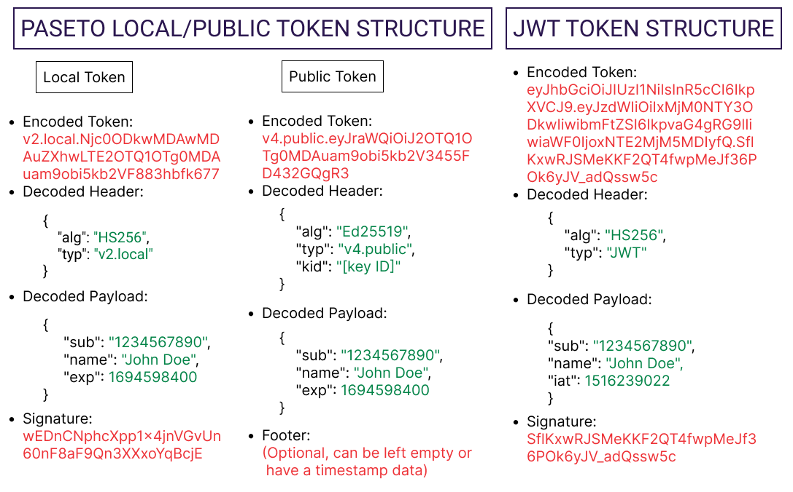

### Comparação entre JWT e PASETO

A escolha entre JWT (JSON Web Tokens) e PASETO (Platform-Agnostic Security Tokens) para autenticação em aplicações web envolve considerar as características, vantagens e desvantagens de cada uma dessas tecnologias. Abaixo está uma comparação detalhada entre JWT e PASETO:

**JWT (JSON Web Tokens)**

**Descrição**:  
JWT é um padrão aberto (RFC 7519) que define um método compacto e independente para transmitir informações entre partes como objetos JSON. Os tokens são usados para verificar identidades de usuários e conceder acesso a recursos privados.

**Estrutura**:  
- **Cabeçalho (Header)**: Define o tipo de token e o algoritmo de assinatura.
- **Payload**: Contém declarações sobre uma entidade, como o usuário.
- **Assinatura (Signature)**: Garante a autenticidade e integridade do token.

**Vantagens**:  
1. **Ampla Adoção**: Suporte em muitas bibliotecas e linguagens.
2. **Flexibilidade**: Pode ser usado para diversos cenários, tanto em aplicativos stateful quanto stateless.

**Desvantagens**:  
1. **Vulnerabilidades Potenciais**: Exige atenção cuidadosa para evitar vulnerabilidades, como o uso indevido do algoritmo `none`.
2. **Desafios de Revogação**: É difícil revogar tokens uma vez emitidos sem mecanismos adicionais.

**PASETO (Platform-Agnostic Security Tokens)**

**Descrição**:  
PASETO é uma especificação para tokens seguros que fornece uma alternativa moderna ao JWT, abordando suas vulnerabilidades inerentes e enfatizando padrões seguros por padrão.

**Estrutura**:  
- **Versão e Propósito**: Usa uma abordagem versionada com tokens locais e públicos.
- **Payload**: Contém declarações semelhantes ao JWT, mas com regras de implementação mais estritas.
- **Footer (Opcional)**: Pode incluir dados adicionais autenticados.

**Vantagens**:  
1. **Segurança por Padrão**: Elimina o risco de confusão de algoritmos ao especificar claramente quais devem ser usados.
2. **Facilidade de Implementação**: Reduz a probabilidade de opções inseguras serem escolhidas acidentalmente.

**Desvantagens**:  
1. **Adoção Limitada**: Menos suporte de bibliotecas comparado ao JWT, embora isso esteja crescendo.
2. **Curva de Aprendizado**: Pode exigir mais esforço inicial para desenvolvedores familiarizados com JWT.

### Principais Diferenças

| Aspecto                | JWT                                                       | PASETO                                                     |
|------------------------|-----------------------------------------------------------|------------------------------------------------------------|
| **Abordagem**          | Estrutura única e genérica.                               | Abordagem versionada com propósitos específicos (local/público). |
| **Componentes**        | Cabeçalho, payload, assinatura.                           | Cabeçalho, payload, footer opcional.                       |
| **Confusão de Algoritmos** | Vulnerável se `none` for permitido.                     | Eliminado pela especificação clara de algoritmos.          |
| **Gestão de Chaves**   | Requer implementação cuidadosa para evitar vulnerabilidades. | Melhores práticas promovidas por design.                   |
| **Revogação**          | Desafiadora sem mecanismos adicionais.                    | Mais fácil devido à abordagem de versionamento.            |
| **Cenários de Uso**    | Usado tanto em aplicativos stateful quanto stateless.     | Tokens locais para sessões stateful, tokens públicos para autenticação stateless. |

### Considerações para Escolha

- **Necessidades de Segurança**: Se a segurança robusta e proteção contra vulnerabilidades comuns são prioridades, PASETO pode ser a melhor escolha.
- **Arquitetura da Aplicação**: PASETO é adequado para aplicativos tradicionais com gerenciamento de sessões server-side (tokens locais) e aplicações orientadas a microserviços (tokens públicos).
- **Familiaridade do Desenvolvedor**: JWT tem uma adoção mais ampla e recursos disponíveis, facilitando a implementação.
- **Suporte no Ecossistema**: PASETO está expandindo seu suporte, mas ainda não alcançou a abrangência do JWT.

### Referência

- [JWT vs PASETO: New Era of Token-Based Authentication](https://permify.co/post/jwt-paseto/)